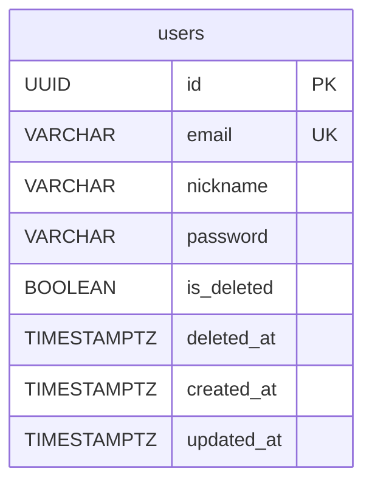
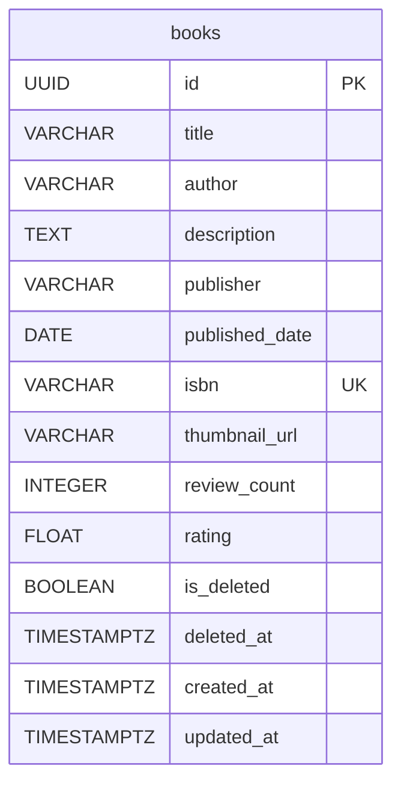
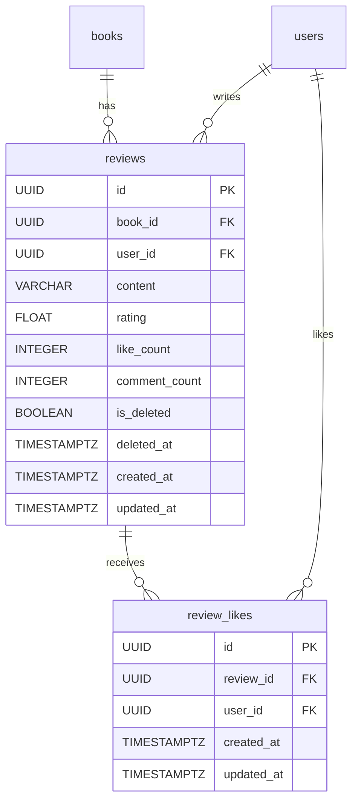
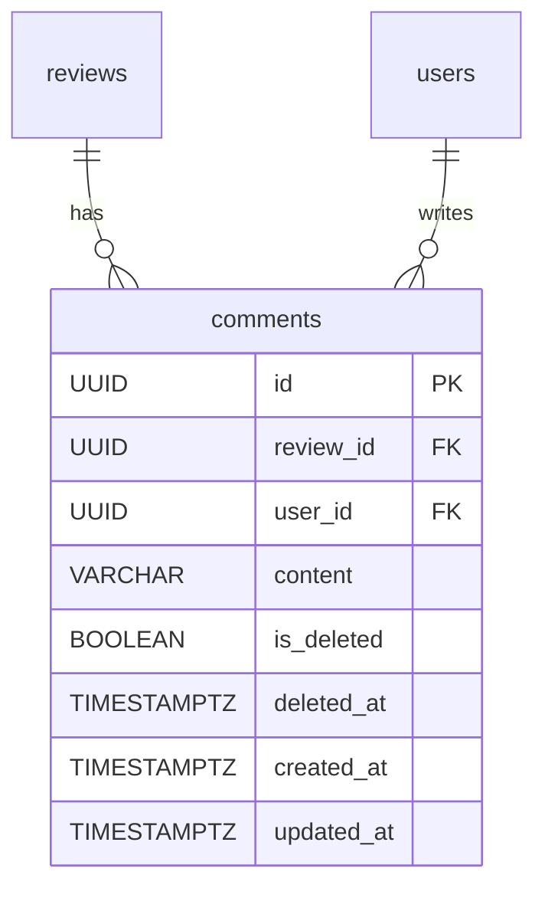
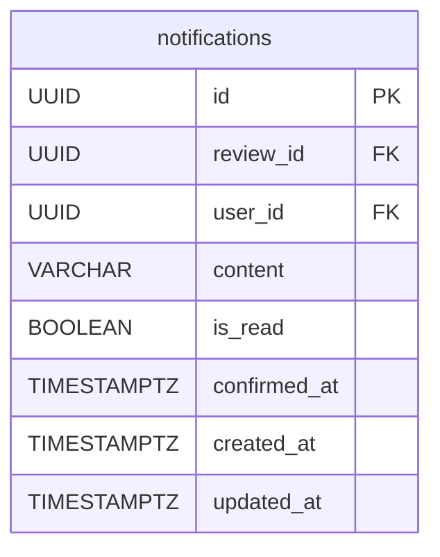
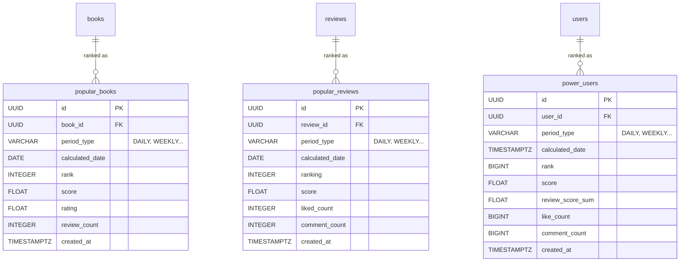

# sb10-deokhugam-team01

## Codecov

[](https://codecov.io/github/sb10-part03-team01/sb10-deokhugam-team01)

### [팀 노션 페이지 링크](https://plume-wavelength-88d.notion.site/_-03_-01-0cfa756433c1834eb1b2812a878f46b5?pvs=74)

## 팀원 구성

| 프로필 |                     이름                     |  역할  | 담당 기능                                                                                     |
|:---:|:-----------------------------------------:|:--------:|:--------------------------------------------------------------|
|  | **[김현재](https://github.com/hyunjae3458)** | **도서 관리 도메인,<br>README 작성** | **[주요 기능]**<br>- 도서 관리 API 구현 (CRUD 및 커서 페이지네이션)<br>- Naver Book & OCR Space API 연동<br>**[추가/인프라 기능]**<br>- S3 썸네일 업로드 트랜잭션 동기화 |
|  |   **[문정환](https://github.com/mjohn26)**   | **리뷰 관리, 인기 리뷰 도메인,<br>노션 정리** | **[주요 기능]**<br>- 리뷰 관리 API 구현<br>- 인기 리뷰 대쉬보드 API 구현<br>**[추가/인프라 기능]**<br>- (도메인 비즈니스 로직 고도화 집중) |
|  |   **[박승민](https://github.com/raonPsm)**   | **유저 관리 도메인, 인프라 설정,<br>PPT 제작** | **[주요 기능]**<br>- 유저 관리 API 구현<br>**[추가/인프라 기능]**<br>- AWS 인프라 환경 구축 및 GitHub Actions CI/CD 설정<br>- CodeRabbit(AI 리뷰), Codecov(테스트 커버리지) 연동 |
|  |  **[안승리](https://github.com/Atory0206)**  | **알림 관리, 파워 유저 도메인,<br>발표** | **[주요 기능]**<br>- 알림 관리 API 구현<br>- 파워 유저 대쉬보드 API 구현<br>**[추가/인프라 기능]**<br>- (도메인 비즈니스 로직 고도화 집중) |
|  | **[최종인](https://github.com/jongin-git)**  | **댓글 관리, 인기 도서 도메인,<br>시연 영상 제작** | **[주요 기능]**<br>- 댓글 관리 API 구현<br>- 인기 도서 대쉬보드 API 구현<br>**[추가/인프라 기능]**<br>- MDC 기반 Request ID & IP 로깅 및 헤더 응답 처리 |

---

## 프로젝트 소개

- 덕후감: 도서 이미지 OCR 및 ISBN 매칭 서비스
- 프로젝트 기간: 2026.04.14 ~ 2026.05.08

---

## 배포 사이트

http://3.37.127.27

---

## 기술 스택

### Backend


### Database


### Infrastructure


### CI/CD & Code Quality


### Collaboration Tools


---

## ERD (Entity-Relationship Diagram)

전체 데이터베이스의 구조를 한눈에 파악할 수 있는 전체 ERD입니다.


---

## 도메인별 ERD 상세

테이블 수가 많아 복잡도를 낮추기 위해 **각 도메인(Domain)별로 구조를 분리**하여 상세히 나타냈습니다.  

<details>
<summary><b>1. 유저(User) 도메인</b></summary>
    
<div markdown="1">
<br>
회원 관리에 필요한 핵심 테이블 구조입니다.
    

</div>
</details>

<details>
<summary><b>2. 도서(Book) 도메인</b></summary>
    
<div markdown="1">
<br>
도서 메타데이터, ISBN 매칭 정보 등 핵심 비즈니스 로직을 담당하는 테이블 구조입니다.
    

</div>
</details>

<details>
<summary><b>3. 리뷰(Review) 도메인</b></summary>
    
<div markdown="1">
<br>
유저가 도서에 남긴 리뷰, 평점, 좋아요 등의 정보를 관리하는 테이블 구조입니다.
    

</div>
</details>

<details>
<summary><b>4. 댓글(Comment) 도메인</b></summary>
    
<div markdown="1">
<br>
리뷰에 대한 유저 간의 소통(댓글 및 대댓글)을 관리하는 테이블 구조입니다.
    

</div>
</details>

<details>
<summary><b>5. 알림(Notification) 도메인</b></summary>
    
<div markdown="1">
<br>
시스템 알림 및 유저 간 상호작용 알림을 처리하는 테이블 구조입니다.
    

</div>
</details>

<details>
<summary><b>6. 대쉬보드 및 통계(Dashboard & Statistics) 도메인</b></summary>
    
<div markdown="1">
<br>
인기 도서, 리뷰 통계, 유저 활동 지표 등 대쉬보드 화면 렌더링과 집계에 최적화된 테이블 구조입니다.
    

</div>
</details>

---

## 인프라 아키텍처 다이어그램


---

## 팀원별 구현 기능 상세

### 김현재


- **도서 관리 API**
    - 도서 등록, 수정, 삭제, 상세 조회 API 구현 및 유효성 검증(Validation) 로직 작성
- **외부 인프라 및 API 연동**
    - AWS S3를 활용한 썸네일 이미지 업로드 및 Presigned URL 발급 로직 구현
    -  네이버 도서 검색 API 연동
    -  OCR Space API 연동

### 문정환

(자신이 개발한 기능에 대한 사진이나 gif 파일 첨부)

- **회원별 권한 관리**
    - Spring Security를 활용하여 사용자 역할에 따른 권한 설정
    - 관리자 페이지와 일반 사용자 페이지를 위한 조건부 라우팅 처리
- **반응형 레이아웃 API**
    - 클라이언트에서 요청된 반응형 레이아웃을 위한 RESTful API 엔드포인트 구현

### 박승민

(자신이 개발한 기능에 대한 사진이나 gif 파일 첨부)

- **수강생 정보 관리 API**
    - `GET`요청을 사용하여 학생의 수강 정보를 조회하는 API 엔드포인트 개발
    - 학생 정보의 CRUD 처리 (Spring Data JPA 사용)
- **공용 Button API**
    - 공통으로 사용할 버튼 기능을 처리하는 API 엔드포인트 구현

### 안승리

(자신이 개발한 기능에 대한 사진이나 gif 파일 첨부)

- **관리자 API**
    - `@PathVariable`을 사용한 동적 라우팅 기능 구현
    - `PATCH`,`DELETE`요청을 사용하여 학생 정보를 수정하고 탈퇴하는 API 엔드포인트 개발
- **CRUD 기능**
    - 학생 정보의 CRUD 기능을 제공하는 API 구현 (Spring Data JPA)
- **회원관리 슬라이더**
    - 학생별 정보 목록을`Carousel`형식으로 조회하는 API 구현

### 최종인

(자신이 개발한 기능에 대한 사진이나 gif 파일 첨부)

- **학생 시간 정보 관리 API**
    - 학생별 시간 정보를`GET`요청을 사용하여 조회하는 API 구현
    - 실시간 접속 현황을 관리하는 API 엔드포인트
- **수정 및 탈퇴 API**
    - `PATCH`,`DELETE`요청을 사용하여 수강생의 개인정보 수정 및 탈퇴 처리
- **공용 Modal API**
    - 공통 Modal 컴포넌트를 처리하는 API 구현

---

## 파일 구조

```Markdown
.
┣ .github
┃ ┣ ISSUE_TEMPLATE
┃ ┣ workflows
┃ ┗ PULL_REQUEST_TEMPLATE.md
┣ src
┃ ┣ main
┃ ┃ ┣ java
┃ ┃ ┃ ┗ com.team01.deokhugam
┃ ┃ ┃   ┣ batch
┃ ┃ ┃   ┣ book
┃ ┃ ┃   ┣ comment
┃ ┃ ┃   ┣ dashboard
┃ ┃ ┃   ┣ global
┃ ┃ ┃   ┃ ┣ config
┃ ┃ ┃   ┃ ┣ constant
┃ ┃ ┃   ┃ ┣ entity
┃ ┃ ┃   ┃ ┣ enums
┃ ┃ ┃   ┃ ┣ exception
┃ ┃ ┃   ┃ ┣ filter
┃ ┃ ┃   ┃ ┣ pagination
┃ ┃ ┃   ┃ ┗ util
┃ ┃ ┃   ┣ notification
┃ ┃ ┃   ┣ review
┃ ┃ ┃   ┗ user
┃ ┃ ┗ resources
┃ ┃     ┣ db
┃ ┃     ┗ static
┃ ┗ test
┃     ┗ java
┃         ┗ com.team01.deokhugam
┃           ┣ batch
┃           ┣ book
┃           ┣ comment
┃           ┣ config
┃           ┣ dashboard
┃           ┣ global
┃           ┣ notification
┃           ┣ review
┃           ┗ user
┣ codecov.yml
┣ coderabbit.yml
┗ README.md
```

---

## 프로젝트 회고록

(제작한 발표자료 링크 혹은 첨부파일 첨부)
